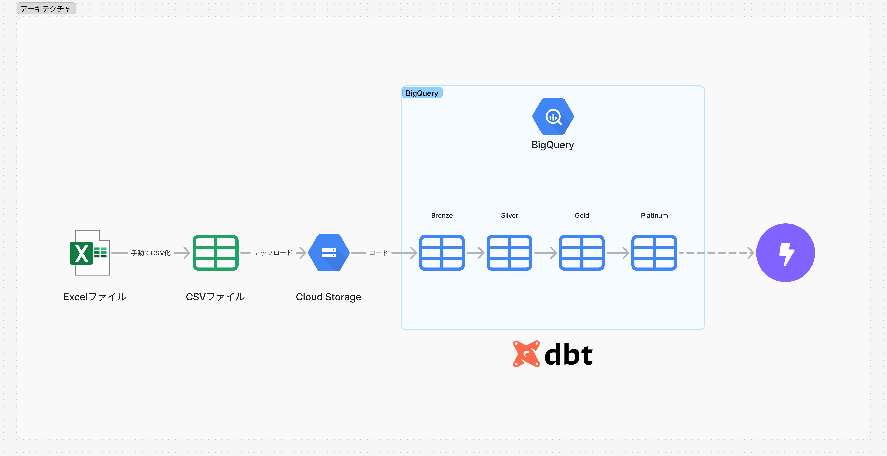
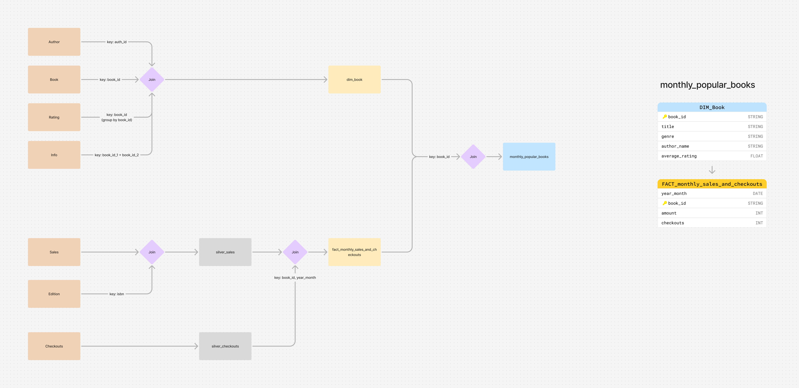

# dbt sample project: Bookshop

This is the dbt sample project using [Bookshop dataset provided by Tableau](https://help.tableau.com/current/pro/desktop/ja-jp/bookshop_data.htm).

## Architecture

## Transformation
### monthly_popular_books
Transformation and star scheme to analyze popular books by month. 

## Requirements
- Python 3.10
- dbt-core
- dbt-bigquery